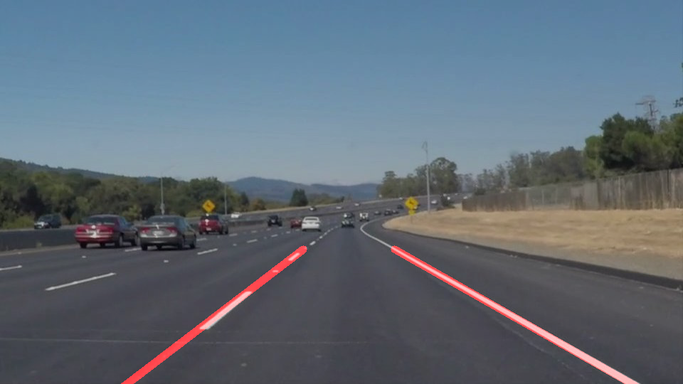

# **Finding Lane Lines on the Road**

### Reflection

### 1. Describe your pipeline. As part of the description, explain how you modified the draw_lines() function.

First, the image was converted to greyscale after which the canny edge detection algorithm was applied to it.
Second, we defined a region of interest, mainly a polygon, by specifying the vertices to get a masked image.
Third, we made the transition from image space to hough space by specifying the various parameters of the hough transformation algorithm.
Finally, this converted image was passed to the draw_lines() function which drew the lane lines on the image as shown below. The draw_lines() function separates line segments based on positive or negative slope and also excludes those segments where the absolute value of slope is less than 0.45. When we have the separate line segments for the left and right lane we extrapolate these segments using np.polyfit() to form a one single line.  

### 2. Identify potential shortcomings with your current pipeline

In both the test videos, one of the lane lines seem to oscillate a little. Also, the pipeline does not work well with the challenge video.

### 3. Suggest possible improvements to your pipeline

The oscillations in the videos could be reduced so as to better identify the lanes. Also, the pipeline could be made more robust to perform better in scenarios such as the one given in the challenge video. 
